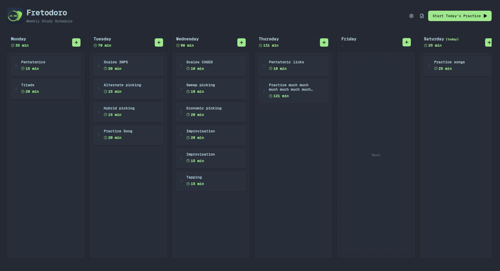

# Fretodoro

Fretodoro is a highly visual, drag-and-drop weekly study schedule and practice management application tailored for musicians, guitarists, and dedicated learners. It takes the proven focus-boosting principles of the Pomodoro technique and applies them to a customizable weekly planner.

<p align="center">
  
</p>

## Overview

The core philosophy of **Fretodoro** is to break down your large, intimidating practice goals (like learning complex scales, sweep picking, or memorizing new songs) into bite-sized, timed blocks. The user interface provides a bird's-eye view of your entire week, allowing you to organize, balance, and execute your practice sessions effectively.

### Key Features

*   **Comprehensive Weekly View:** Plan out your entire week from Monday to Sunday. Each day works as an independent column to organize your practice sessions.
*   **Timed Practice Blocks:** Add custom study blocks with specific durations (e.g., "Pentatonics - 15 min", "Scales 3NPS - 20 min", "Sweep Picking - 10 min").
*   **Drag and Drop Organization:** Easily reorder your practice modules within a day by dragging the handle on the left side of any block.
*   **Rest Days:** Not every day needs to be a grind. The application supports explicitly marking days as "Rest" days to help avoid burnout.
*   **One-Click Practice Mode:** Press the "Start Today's Practice" button to instantly jump into a focused session with your loaded daily sequence.
*   **Localization:** Features a built-in language switcher to alternate between English (EN) and other supported languages.
*   **Dark Theme:** A sleek, modern user interface designed with a dark, high-contrast theme focused on reducing eye strain during long practice sessions.

<br>

<p align="center">
  <b>Focused Practice Mode</b><br>
  Execute your plan effectively.
</p>
<p align="center">
  
</p>


## Built With

This desktop application is built with modern, performant web technologies packaged natively:
*   **Tauri** - For packaging the web app as a native desktop application.
*   **React** - Providing the component-based, interactive user interface.
*   **TypeScript** - Ensuring reliability and type safety across the codebase.
*   **Vite** - For lightning-fast local development and bundling.

## Getting Started

To run Fretodoro locally, ensure you have Node.js and Rust installed (for Tauri).

```bash
# Clone the repository
git clone https://github.com/your-username/fretodoro.git

# Navigate to the project directory
cd fretodoro

# Install dependencies
pnpm install

# Start the development server
pnpm tauri dev
```

---
*Elevate your practice routine and master your instrument with Fretodoro.*
